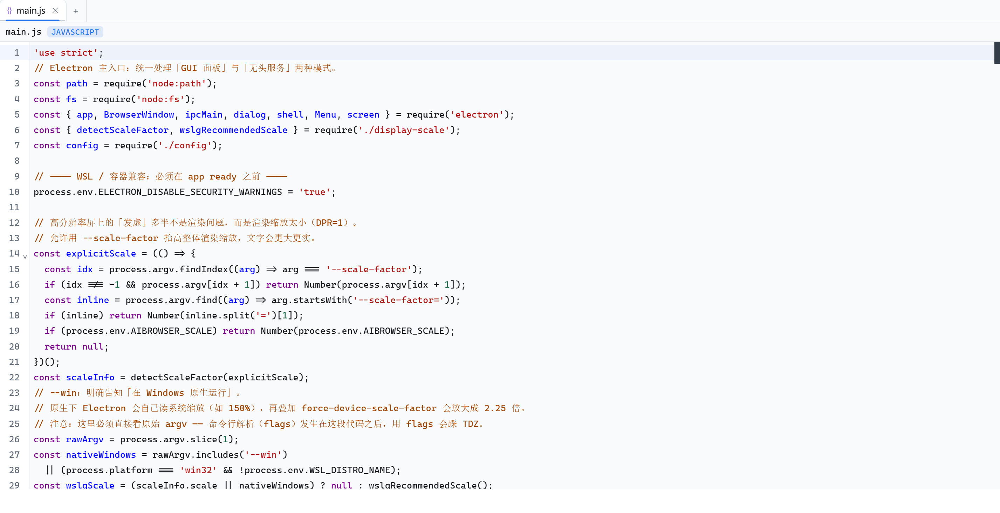
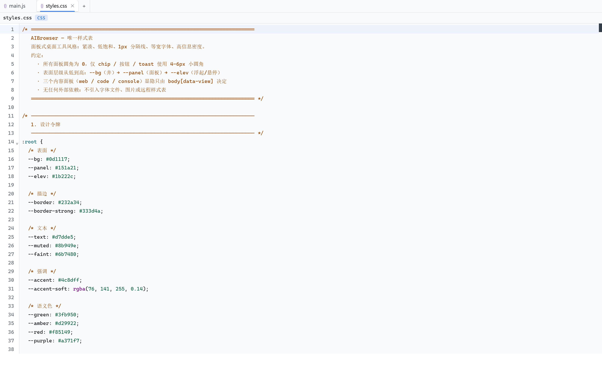
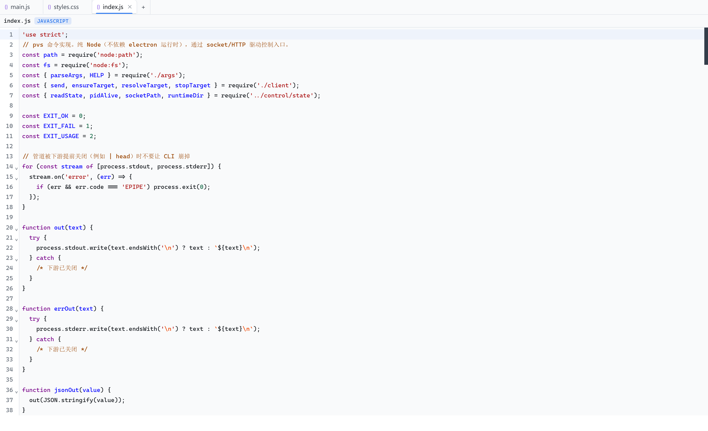
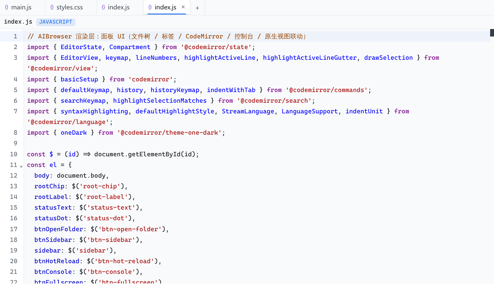
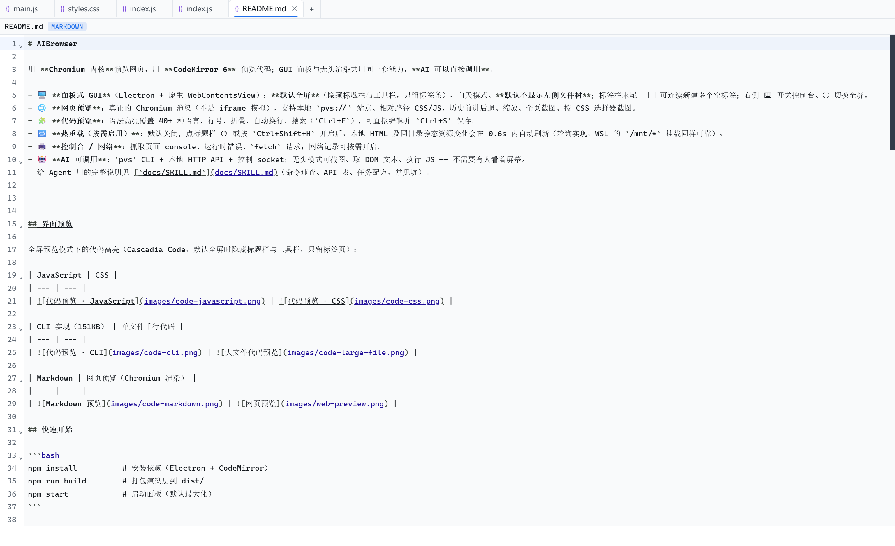
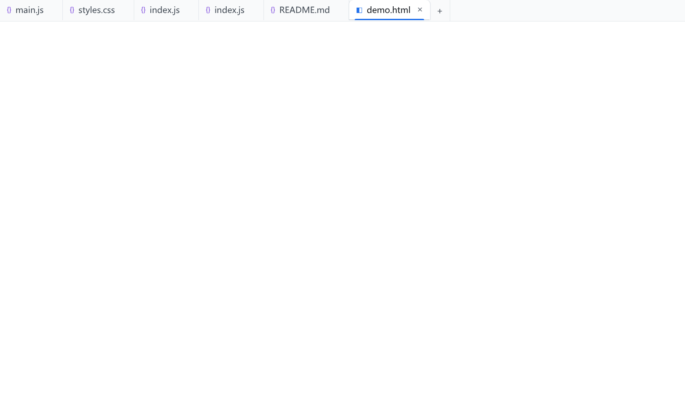

# AIBrowser

用 **Chromium 内核**预览网页，用 **CodeMirror 6** 预览代码；GUI 面板与无头渲染共用同一套能力，**AI 可以直接调用**。

- 🖥️ **面板式 GUI**（Electron + 原生 WebContentsView）：**默认全屏**（隐藏标题栏与工具栏，只留标签条）、白天模式、**默认不显示左侧文件树**；标签栏末尾「＋」可连续新建多个空标签；右侧 ⌨ 开关控制台、⛶ 切换全屏。
- 🌐 **网页预览**：真正的 Chromium 渲染（不是 iframe 模拟），支持本地 `pvs://` 站点、相对路径 CSS/JS、历史前进后退、缩放、全页截图、按 CSS 选择器截图。
- 🧩 **代码预览**：语法高亮覆盖 40+ 种语言，行号、折叠、自动换行、搜索（`Ctrl+F`），可直接编辑并 `Ctrl+S` 保存。
- 🔁 **热重载（按需启用）**：默认关闭；点标题栏 ⟳ 或按 `Ctrl+Shift+H` 开启后，本地 HTML 及同目录静态资源变化会在 0.6s 内自动刷新（轮询实现，WSL 的 `/mnt/*` 挂载同样可靠）。
- 🖨️ **控制台 / 网络**：抓取页面 console、运行时错误、`fetch` 请求；网络记录可按需开启。
- 🤖 **AI 可调用**：`pvs` CLI + 本地 HTTP API + 控制 socket；无头模式可截图、取 DOM 文本、执行 JS —— 不需要有人看着屏幕。
  给 Agent 用的完整说明见 [`docs/SKILL.md`](docs/SKILL.md)（命令速查、API 表、任务配方、常见坑）。

---

## 界面预览

Windows 原生运行下的界面（全屏模式：只留标签条，标题栏与工具栏隐藏）。
截图尺寸 **3072×1876**，与 3072 宽屏幕的物理像素一致：

| JavaScript | CSS |
| --- | --- |
|  |  |

| CLI 实现 | 单文件千行代码 |
| --- | --- |
|  |  |

| Markdown | 网页预览（Chromium 渲染） |
| --- | --- |
|  |  |

> 代码区使用 Cascadia Code（含编程连字）；界面中文字体优先微软雅黑/苹方/思源黑体。
> 想在 WSL 里获得同样的画质，见 [`docs/NOTES.md`](docs/NOTES.md) 的「在 Windows 原生运行」。

## 快速开始

```bash
npm install          # 安装依赖（Electron + CodeMirror）
npm run build        # 打包渲染层到 dist/
npm start            # 启动面板（默认最大化）
```

首次运行会自动把**当前工作目录**作为项目根目录：文件树里点 `.html`/`.svg` 进网页预览，点其它文件进代码预览。

## 作为 Skill 给其它 Agent 调用

`skills/aibrowser/` 是一份**可分发的 Agent Skill**（标准结构：`SKILL.md` + `scripts/` + `references/`），
让其它 agent 能直接获得「打开网页/代码 → 取渲染结果 → 执行 JS → 截图 → 读报错」的能力。

```bash
bash skills/aibrowser/install.sh          # 安装到本机 skill 目录（符号链接，仓库更新即同步）
bash skills/aibrowser/scripts/ensure-service.sh   # 确保后台服务就绪（幂等）
```

其它 agent 侧只需要 skill 目录，路径由 `scripts/resolve-home.sh` 自动解析：
`$PVS_HOME` → 安装时记录的 `~/.aibrowser-skill.env` → 同仓库副本 → `PATH` 里的 `pvs`。

```bash
S=<skill目录>/scripts/pvs.sh
$S open ./index.html --root . --json
$S content --selector "#main" --json
$S shot --out /tmp/page.png --full-page --json
```

| 文件 | 作用 |
| --- | --- |
| `SKILL.md` | 触发条件、命令速查、错误码处置（agent 读这一份就够） |
| `scripts/pvs.sh` | CLI 包装：自动找到项目并把命令转交 `pvs` |
| `scripts/ensure-service.sh` | 确保无头服务就绪（幂等，首次调用时自动拉起） |
| `scripts/resolve-home.sh` | 路径解析（支持符号链接安装） |
| `references/api.md` | HTTP API 与全部动作名（长驻服务场景更省开销） |
| `install.sh` | 安装到 `~/.codex/skills`、`~/.codefree-cli/skills` 等已有目录 |

## GUI 快捷键

| 快捷键 | 作用 |
| --- | --- |
| `Ctrl/Cmd + O` | 打开文件夹（作为项目根目录） |
| `Ctrl/Cmd + B` | 显示/隐藏左侧文件树 |
| `Ctrl/Cmd + T` | 新建标签页（等价于点标签条末尾的「＋」） |
| `Ctrl/Cmd + J` | 开关控制台（也可点标题栏 ⌨ 图标） |
| `Ctrl/Cmd + Shift + M` | 切换全屏预览（**默认开启**）——隐藏标题栏与工具栏，只留标签页；也可点 ⛶ 图标 |
| `Esc` | 退出全屏预览（先关控制台抽屉、再退全屏） |
| `Ctrl/Cmd + 滚轮` | 缩放整个界面（面板与代码字号），也可用菜单里的「界面放大/缩小/重置」 |
| `Ctrl/Cmd + Shift + = / - / 0` | 界面放大 / 缩小 / 重置（60%~300%） |
| `Ctrl/Cmd + Shift + H` | 开关热重载（也可点标题栏 ⟳ 图标）；默认关闭 |
| `Ctrl/Cmd + R` / `Shift+R` | 刷新预览 / 强制刷新（绕过缓存） |
| `Ctrl/Cmd + F` | 代码视图内搜索 |
| `Ctrl/Cmd + S` | 保存当前代码文件 |

## CLI：`pvs`

```bash
node bin/pvs.js <命令>           # 直接用
npm link && pvs <命令>           # 或者安装到 PATH，之后可以直接 pvs
```

| 命令 | 说明 |
| --- | --- |
| `pvs open <file\|url>` | 打开网页预览（HTML / 目录 / URL 自动识别） |
| `pvs code <file> [--line n]` | 打开代码高亮预览 |
| `pvs list` | 列出会话与已打开的项目目录 |
| `pvs shot [id] [--out f.png] [--full-page] [--selector css] [--format png\|jpeg]` | 截图（无头也能截） |
| `pvs content [id] [--selector css] [--html]` | 取渲染后的文本 / HTML |
| `pvs eval "<js>"` | 在页面里执行 JS（结果自动序列化，支持 undefined / DOM / 循环引用） |
| `pvs console [id] [--clear]` | 读取控制台日志 |
| `pvs network [id] [--on\|--off] [--clear]` | 网络请求记录 |
| `pvs reload [id] [--hard]` / `pvs close [id\|--all]` | 刷新 / 关闭会话 |
| `pvs serve [--gui]` / `pvs stop` / `pvs status` | 常驻服务（`--gui` 开面板窗口，否则纯无头） |

通用参数：`--json`（单行 JSON 输出，便于脚本与 AI 解析）、`--root <dir>`、`--daemon`、`--gui`、`--no-spawn`、`--quiet`。

**没有实例也能用**：直接 `pvs open examples/demo.html` 会按需拉起一个无头守护进程，之后所有命令复用它。

```bash
# 典型无头流程（AI / CI 友好）
pvs open ./site/index.html --root ./site                   # 打开本地站点
pvs eval "document.querySelector('#price').innerText"      # 读取渲染后的数据
pvs shot --out /tmp/check.png --full-page                  # 全页截图
pvs console --json | jq '.entries[] | select(.level=="error")'   # 检查页面报错
pvs stop
```

## HTTP API（无头渲染服务）

`pvs serve` 或任何运行中的实例都会在 `state.json` 暴露端口与令牌：

```bash
STATE="${XDG_RUNTIME_DIR:-$HOME/.aibrowser}/aibrowser/state.json"
PORT=$(jq -r .port "$STATE"); TOKEN=$(jq -r .token "$STATE")

curl -s -X POST "http://127.0.0.1:$PORT/open" \
  -H "content-type: application/json" -H "X-PVS-Token: $TOKEN" \
  -d '{"file":"./examples/demo.html"}'

curl -s -X POST "http://127.0.0.1:$PORT/eval" -H "X-PVS-Token: $TOKEN" \
  -H "content-type: application/json" -d '{"expression":"document.title"}'

curl -s "http://127.0.0.1:$PORT/screenshot?format=png&token=$TOKEN" -o shot.png
curl -s "http://127.0.0.1:$PORT/health"            # 免鉴权健康检查
```

动作清单（socket 与 HTTP 完全等价）：`ping` `open` `openCode` `openPath` `list` `focus` `reload` `close`
`navigate` `screenshot` `content` `eval` `console` `network` `zoom` `save` `read` `tree` `roots` `ui` `shutdown`
以及调试用 `panelState` / `panelEditor` / `panelActions` / `debugLayout`。

## GUI 与无头的关系

- 任何时刻只有一个「控制器」进程持有控制通道；后启动的实例会**接管**（旧实例优雅退出），CLI 永远连到最新那个。
- GUI 里的每个网页标签就是一个原生 `WebContentsView`，位置由渲染层上报的槽位实时对齐（面板尺寸变化、侧栏开关都会重算）。
- 无头会话使用**离屏渲染**；截图优先取 `paint` 帧，取不到时回退 `capturePage`，两条路都不需要显示窗口。

## 验收 / 自检

```bash
npm run smoke     # 无头全链路：本地页面 → 渲染文本 → eval → 控制台 → 截图 → 像素校验
npm run verify    # GUI 端到端：31 项断言，覆盖代码渲染、网页渲染、热重载、空标签、全屏、缩放
```

`npm run smoke` 会校验截图里真的出现了页面上的强调色像素，`npm run verify` 会校验编辑器里真的渲染出可见行 —— 避免「看起来起来了其实没渲染」。

## 项目结构

```
bin/pvs.js                  CLI 入口
src/main/
  main.js                   进程引导（GUI / 无头两种模式、菜单、IPC）
  preview-session.js        一个预览会话：加载、截图、eval、控制台、热重载
  preview-manager.js        会话表 + 面板内原生视图寄宿
  preview-protocol.js       pvs:// 本地站点协议 + 注入脚本（日志/热重载）
  file-service.js           根目录授权、文件树、读写
  language.js               扩展名 → 语言识别
  display-scale.js          显示缩放探测（WSLg 场景）
  config.js                 用户偏好持久化（界面缩放等）
  control/server.js         socket + HTTP + WebSocket 控制服务
  control/state.js          控制通道发现（state.json / socket 接管）
  cli/                      pvs 命令解析、客户端、命令实现
  preload.js                contextBridge 通道
src/renderer/               面板 UI（index.html / index.js / styles.css）
scripts/                    构建、端到端验收、面板像素检查
examples/                   示例页面（demo.html / font-compare.html）
skills/aibrowser/           可分发的 Agent Skill（SKILL.md + scripts + references）
docs/CONTRACT.md            架构与接口契约（含完整 API 表）
docs/SKILL.md               给 AI Agent 的使用说明（可直接喂给模型）
docs/NOTES.md               额外说明（显示质量 / 字体 / 缩放 / Windows 原生运行 / 容器兼容）
```

## 常见问题

- **面板里网页区域空着？** 网页是原生视图覆盖在面板槽位上的，不是 DOM；先看状态栏与「控制台」里的加载错误。
- **代码文件打开没内容？** 早期版本在容器隐藏时创建编辑器会渲染 0 行，现已强制重新测量；仍有问题就把 `pvs console` 与 `panelState` 发出来。
- **热重载没反应？** 只关注同目录的 `html/css/js/json/svg/md`，其它目录的改动不触发；轮询间隔 0.6s。
- **想要普通窗口而不是最大化？** `electron . --no-maximize`。
- **显示质量、字体、缩放、Windows 原生运行、容器兼容** → 见 [`docs/NOTES.md`](docs/NOTES.md)

